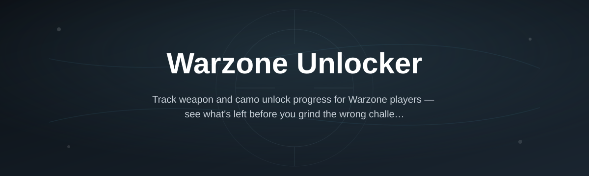
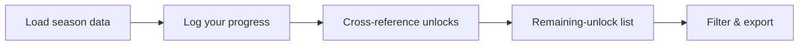

# warzone-unlock-tracker

*A Warzone Unlocker built for players who'd rather grind camos than spreadsheets.*

## What this is

**TL;DR:** A desktop tool that tracks which weapons, camos, operators, and blueprints you still have left to unlock in Call of Duty: Warzone.

warzone-unlock-tracker is a Warzone Unlocker in the literal sense of the word — it keeps a running record of your unlock progress instead of forcing you to scroll through in-game menus or third-party wikis. Point it at your current season, and it lays out exactly which camos, operator skins, and weapon variants are still locked, and what challenge or level gate is blocking each one.

It doesn't touch your game files, your account, or your matchmaking. It reads publicly available season data and lets you log your own progress against it, so you always know what's left before the season rotates out from under you.

  

The button above opens the project landing page, where you download the current build.

## Who it is for

**TL;DR:** Built for grinders, not casuals who unlock everything by accident.

- **Camo grinders** chasing mastery or reactive camo lines before a season ends.
- **Competitive players** who need specific weapon variants unlocked for loadouts.
- **Content creators** tracking challenge progress on stream or in videos.
- **Clan and community organizers** comparing unlock progress across members.
- **Returning players** who left mid-season and need to see what they missed.

## What you can do

**TL;DR:** Track, filter, and export — nothing you do here touches the game itself.

- **Track weapon camo progress** across base, mastery, and reactive tiers.
- **Monitor operator and skin unlocks** tied to season challenges.
- **See battle pass unlock requirements** without opening the in-game menu.
- **Flag level- or prestige-locked items** so you know what's blocking a grind.
- **Export a progress snapshot** to share with your clan or squad.
- **Get flagged on time-limited event unlocks** before they rotate out.
- **Filter by weapon platform, category, or season** to focus on one grind at a time.
- **Run entirely offline** after the first data pull — no account linking.

## Getting started

**TL;DR:** Download, run, load your season, start tracking.

1. Open the landing page using the download button above.
2. Download the current release for your Windows version.
3. Run the `.exe` — no installer, no setup wizard.
4. Select the current Warzone season when prompted.
5. Start checking off unlocks as you earn them.

## Requirements

**TL;DR:** Windows only, standalone, nothing else to install.

- Windows 10 or 11 (64-bit).
- Standalone executable — no toolchain, runtime, or package manager needed.
- Internet connection only required for the initial download and season data pull.
- Roughly 150 MB free disk space.

## How it works

**TL;DR:** Load season data, log progress, get flagged on what's left.

1. The app pulls current season unlock data (weapons, camos, operators).
2. You import or manually log your own in-game progress.
3. It cross-references the two and builds your remaining-unlock list.
4. You filter by category or platform to focus your next session.
5. Progress is saved locally and updates as you log new unlocks.

## FAQ

**TL;DR:** The questions people actually search before installing something like this.

**What is a Warzone Unlocker exactly?**
It's a tracking tool — it shows you which weapons, camos, and operators you haven't unlocked yet and what's required to get them. It doesn't unlock anything on your behalf.

**Does this modify my game files?**
No. It reads season data separately and never touches your Warzone installation or save data.

**Will using it get my account banned?**
It doesn't interact with the game client or your Activision account, so there's nothing for anti-cheat systems to detect.

**Does it work with the current Warzone season?**
Season data is updated on each seasonal rotation. Check the landing page for the latest supported season before downloading.

**Is there a Mac or console version?**
Not currently. It's a Windows desktop application only.

## Troubleshooting

**TL;DR:** Most issues are Windows security prompts, not the app itself.

- **Windows SmartScreen blocks the launch** — click "More info" then "Run anyway." This is standard for unsigned indie tools, not a corruption warning.
- **Antivirus flags the executable** — add an exception; the app has no network calls beyond the initial data pull.
- **Progress list looks empty after a season change** — reload season data from the settings menu; old cached data doesn't auto-refresh.
- **Exported snapshot won't open** — make sure you're opening it with a text editor or spreadsheet app, not double-clicking it directly.

## License

**TL;DR:** MIT. Use it, fork it, no warranty attached.

Released under the [MIT License](LICENSE). This project is unaffiliated with Activision or Call of Duty; it's an independent tracking tool built by players, for players. Use at your own discretion.

  

